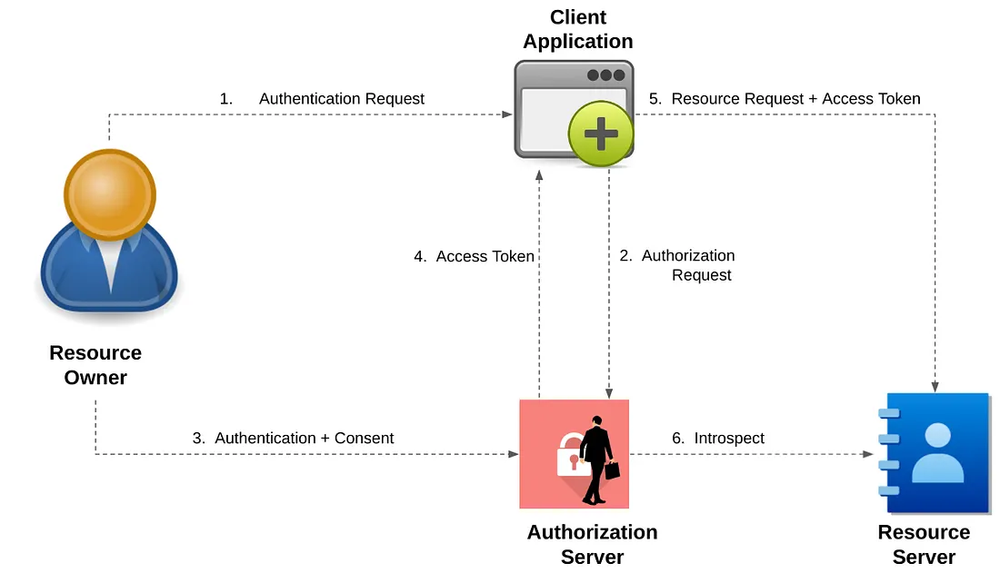
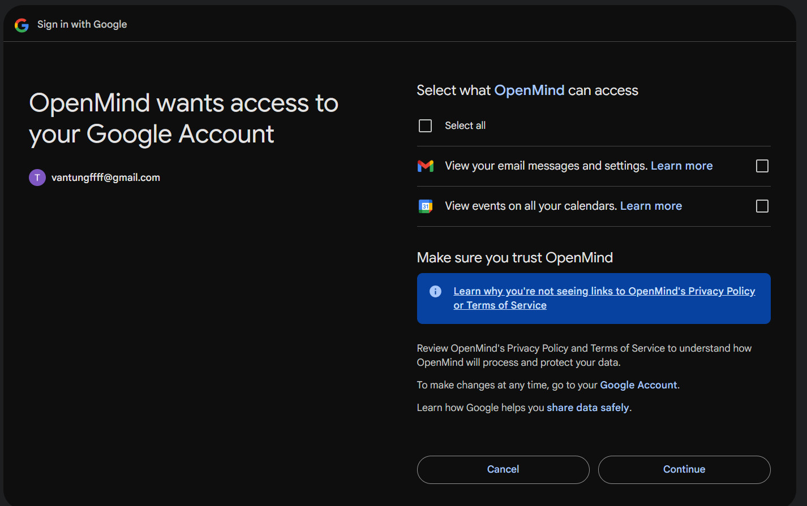
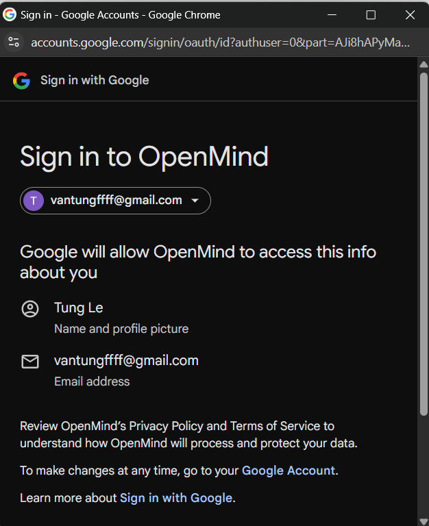

## Scenario
**CRM Integration with Gmail and Calendar**

Applcation CRM lets sales representatives see their Gmail emails and Google Calendar events directly inside the CRM, without giving the CRM their (sale users) Google passwords.

1. User logs in to CRM
    - The sales rep opens the CRM dashboard.
2. CRM asks for permission to access Gmail/Calendar
    - The CRM redirects the user to Google’s OAuth2 authorization endpoint.
    - User sees a consent screen: *“CRM wants to read your emails and events”*.
3. User grants consent
    - Google issues an access token (and optionally a refresh token).
    - The access token has limited scope: e.g., `gmail.readonly`, `calendar.readonly`.
4. CRM calls Google APIs on behalf of the user
    - CRM uses the access token to fetch the user’s emails and calendar events.
    - Emails appear in the CRM dashboard, without ever knowing the user’s Google password.
5. Token expiration and refresh
    - When the access token expires, the CRM uses the refresh token to get a new one.
    - No user interaction is required for this.

## OAuth2 Flow

The application implements the Authorization Code flow:

1. User clicks "Connect Google Account"
2. Redirected to Google's authorization server
3. User grants permissions
4. Google redirects back with authorization code
5. Backend exchanges code for access and refresh tokens
6. Tokens are stored securely and used for API calls
7. Refresh tokens automatically handle token expiration





## OpenID Connect (OIDC)

This application also supports **"Login with Google"** using OpenID Connect, which is an identity layer built on top of OAuth2.

### What is OpenID Connect?

OpenID Connect (OIDC) extends OAuth2 to provide:
- **Authentication** (verifying who the user is) in addition to OAuth2's authorization
- **ID Token**: A JWT containing user identity information (email, name, profile picture)
- **Standardized user info**: Consistent way to get user profile data across providers

### OAuth2 vs OpenID Connect

| Feature | OAuth2 | OpenID Connect |
|---------|--------|----------------|
| Purpose | Authorization (access to resources) | Authentication (user identity) |
| Token Type | Access Token | ID Token + Access Token |
| User Info | Not standardized | Standardized claims (email, name, etc.) |
| Use Case | "Access my Gmail" | "Login with Google" |

### Login with Google Flow



1. User clicks "Sign in with Google" button
2. Google Identity Services (GIS) library handles the authentication
3. User authenticates with Google and grants consent
4. Google returns an **ID Token** (JWT) to the frontend
5. Frontend sends the ID Token to the backend
6. Backend validates the ID Token using Google's public keys
7. Backend extracts user info (email, name) from the token
8. Backend creates/finds the user and issues a JWT session token
9. User is logged into the CRM

### ID Token Claims

The Google ID Token contains standardized claims:
- `sub`: Unique user identifier
- `email`: User's email address
- `email_verified`: Whether email is verified
- `name`: User's full name
- `given_name`: First name
- `family_name`: Last name
- `picture`: Profile picture URL
- `iat`: Issued at timestamp
- `exp`: Expiration timestamp

### Configuration for Login with Google

#### Frontend (environment.ts):
```typescript
export const environment = {
  googleClientId: 'YOUR_GOOGLE_CLIENT_ID'
};
```

#### Backend (appsettings.json):
```json
{
  "Google": {
    "ClientId": "YOUR_GOOGLE_CLIENT_ID"
  }
}
```

## Setup Instructions

### 1. Google OAuth2 Setup

1. Go to [Google Cloud Console](https://console.cloud.google.com/)
2. Create a new project or select existing one
3. Enable Gmail API and Google Calendar API
4. Create OAuth 2.0 credentials:
   - Application type: Web application
   - Authorized redirect URIs: `https://localhost:7001/api/google/callback`
5. Note down the Client ID and Client Secret

### 2. Backend Configuration

1. Update `appsettings.json` with your Google OAuth2 credentials:
   ```json
   {
     "Google": {
       "ClientId": "YOUR_GOOGLE_CLIENT_ID",
       "ClientSecret": "YOUR_GOOGLE_CLIENT_SECRET",
       "RedirectUri": "https://localhost:7001/api/google/callback"
     }
   }
   ```

2. Ensure PostgreSQL connection string is correct in `appsettings.json`

### 3. Database Setup

The application uses Entity Framework Core migrations for database schema management.

```bash
cd src/backend/OpenMind.CRM.Infrastructure
dotnet ef migrations add MigrationName --startup-project ../OpenMind.CRM.API
dotnet ef database update --startup-project ../OpenMind.CRM.API
```

### 4. Run the Application

#### Backend:
```bash
cd src/backend/OpenMind.CRM.API
dotnet restore
dotnet run
```

The API will be available at `https://localhost:7001`

#### Frontend:
```bash
cd src/frontend
npm install
npm start
```

The Angular app will be available at `http://localhost:4200`

## Usage

1. **Register/Login**: Create a new account or login with existing credentials
2. **Connect Google Account**: Click "Connect Google Account" to authorize Gmail and Calendar access
3. **View Dashboard**: Access your emails and calendar events directly in the CRM interface

## License

This project is for educational and demonstration purposes.
